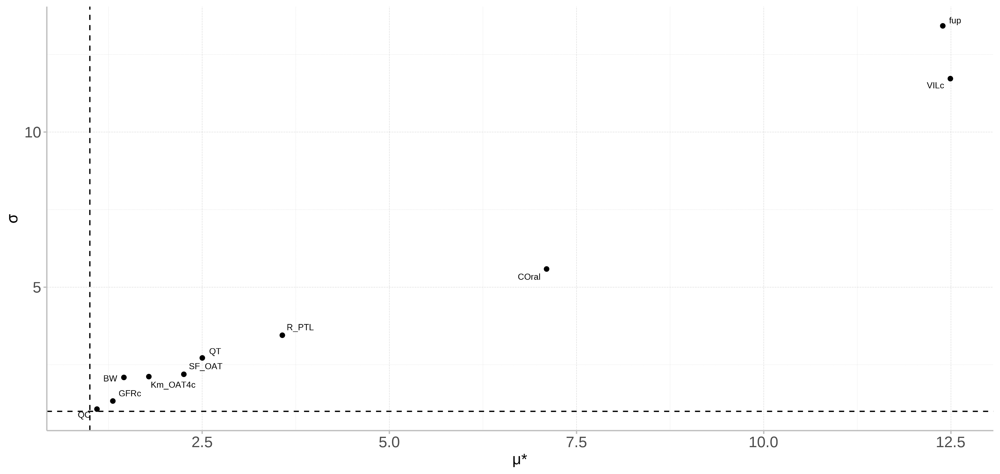
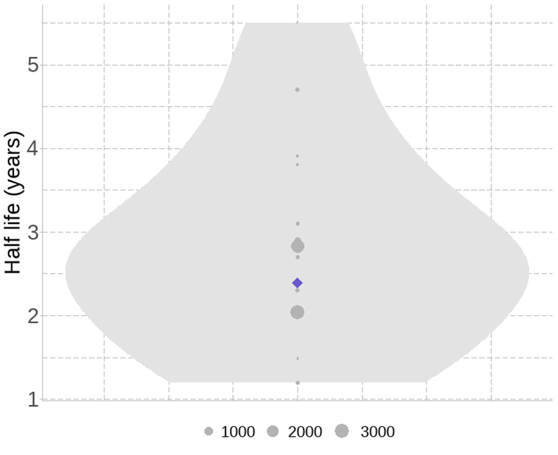

# Introduction

Per- and polyfluoroalkyl substances (PFAS) represent a substantial chemical class, comprising thousands of structurally diverse chemicals, which only have in common one fully fluorinated methyl or methylene carbon atom. PFAS are ubiquitous environmental pollutants of anthropogenic nature and therefore of potential risk to human health. Human toxicological risk assessment of PFAS is challenging, due to their sheer number, structural diversity and paucity of the relevant data required to identify and characterize them. A solution to this challenge lies in the application of read-across approach, which involves the extrapolation of information from a data-rich PFAS to make predictions about a similar data-poor one. One example of this approach could be the application of a Physiologically Based Kinetic (PBK) model from PFOA, to inform the development of PBK models for PFASs with analogous physicochemical properties. Despite the availability of several PBK models for PFOA, all of them rely on PFOA-specific animal-sourced data and are optimised to correctly predict the long half-lives observed in humans. This hinders their use in the read-across scope, where PBK models should be as mechanistic as possible, with key toxicokinetic processes are described based on either in vitro or in silico studies. The present study introduces a human mechanistic PBK model for PFOA, that uses only in vitro derived input parameters.

Too many PFAS PFOA toxicokinetic understanding long half-life, persistence strong binding to proteins (especially albumin and fatty-acid binding proteins) and membrane phospholipids Discussion about previous PBK approaches, need of fitting to data & use of parameters taken from animal studies -\> read-across not possible - What we need: more generic, that we can use for PFAS for which we don’t know information

# Materials and Methods

## PBK Model Development

The PFOA human PBK model was developed with the aim of being as minimal and mechanistic as possible for read-across in a NGRA framework. For this, the critical toxicokinetic processes relevant for PFAS were included, those being renal elimination and re-uptake, enterohepatic circulation and oral, dermal or inhalation exposure. The model was evaluated against observed *in vivo* concentration-time profiles in plasma as well as observed half-life in humans, from human biomonitoring data.[^1]

[^1]: Could consider also evaluation against urine and fecal concentrations from Abraham study, but in this study they mentioned that urinary PFOA concentrations were contaminated while fecal concentrations (ng/g feces) don't represent fecal daily excretion and can't be used for data evaluation

### Model structure

The PBK model was build on the model by [@husøy2023]. The model was updated to include physiological processes related to renal elimination and re-uptake and enterohepatic circulation. The model was structured in a way to enable addition or removal of compartments relevant for different exposure routes.

#### Absorption

##### Oral absorption

Oral absorption via food or drinks is the main route of exposure to PFOA. PFOA is quickly and efficiently absorbed from the gastro-intestinal tract to portal circulation [@abraham2024][^2]. Given the low pKa of PFOA, absorption through the stomach could occur as at gastric pH, a considerable fraction of PFOA is non-ionised and could passively permeate the gastric epithelium to the portal circulation. However, inclusion of this process didn't significantly alter the absorption of PFOA and was excluded from the final model[^3]. PFOA absorption mainly happens in the small

[^2]: Plasma Tmax of 2h after oral exposure (from Abraham)

[^3]: Insert reference to predictions in supplementary material

##### Dermal absorption

Dermal absorption via cosmetic products or dust disposed on skin was modelled 

##### Inhalation absorption

Fast absorption, with Tmax at 3h post exposure (rats) [@gustafsson2022]

PFAS delivery on lung surfactants facilitated by albumin [@pye2023]

For air partition coef [@yao2025]

### Mechanistic kidney sub-compartment

### Mechanistic liver and intestinal sub-compartments

## Model parametrization

The uptake and elimination of PFOA are predicted using in vitro to in vivo extrapolation principles, while its tissue distribution is predicted using experimentally derived distribution coefficients to tissue components, such as albumin and phospholipids. The model introduces a minimal mechanistic kidney compartment to predict the active re-uptake of PFOA in the proximal tubules and a mechanistic transporter-mediated entero-hepatic circulation. Furthermore, given the high affinity of PFOA to albumin, the unbound fraction determined in plasma, is adjusted to the differential albumin concentration between the plasma and tissue or tubular fluid compartments, to better describe an albumin facilitated transport of PFOA. Being proud of yourself

### Derivation of partition coefficients

### In Vitro to In Vivo extrapolation

### Prediction of the adjusted-fraction unbound

## Model evaluation

### Global Sensitivity Analysis Workflow

#### Morris screaning test

#### eFAST test

### Evaluation against human biomonitoring data

Check this study [@domingo2025], [@hanvoravongchai2024a]

# Results

## Model development

Model figure Show results with & without sub compartments, from most complex to less complex and which processess were included

## Model evaluation

### Global Sensitivity Analysis

Finally, the Global Sensitivity Analysis (GSA) workflow recommended by the OECD PBK guideline was applied to both evaluate the validity of the model and inform about the key parameters determining the PBK model predictions.



### Evaluation against human biomonitoring data

The predicted Area Under the Curve (AUC) and half-life were compared to the concentration over time curve from a human volunteer study as well as to observed plasma concentrations and half-lives from the latest human biomonitoring data.



# Discussion

Model limitations : tissue absorption not fully understood, uncertainty of the most sensitive parameters Potential uses?!

The newly developed PFOA PBK model can be extrapolated to other PFASs for which these key parameters are already available. The subsequent derivation of these parameters for other PFASs will facilitate the extrapolation of the present PBK models to them as well and enable their human toxicological risk assessment.

# Conclusion

# Funding

# CRediT authorship contribution statement

# Declaration of Competing Interest

# Acknowledgement

# Appendix A. Supporting information

# Data availability

# FYI (for Chrysa)

## Using CSL

If `cite-method` is set to `citeproc` in `elsevier_article()`, then pandoc is used for citations instead of `natbib`. In this case, the `csl` option is used to format the references. By default, this template will provide an appropriate style, but alternative `csl` files are available from <https://www.zotero.org/styles?q=elsevier>. These can be downloaded and stored locally, or the url can be used as in the example header.

# Equations

Here is an equation: $$ 
  f_{X}(x) = \left(\frac{\alpha}{\beta}\right)
  \left(\frac{x}{\beta}\right)^{\alpha-1}
  e^{-\left(\frac{x}{\beta}\right)^{\alpha}}; 
  \alpha,\beta,x > 0 .
$$

Inline equations work as well: $\sum_{i = 2}^\infty\{\alpha_i^\beta\}$

# Figures and tables

@fig-meaningless is generated using an R chunk.

```{r}
#| label: fig-meaningless
#| fig-cap: A meaningless scatterplot
#| fig-width: 5
#| fig-height: 5
#| fig-align: center
#| out-width: 50%
#| echo: false
plot(runif(25), runif(25))
```

# Tables coming from R

Tables can also be generated using R chunks, as shown in @tbl-simple example.

```{r}
#| label: tbl-simple
#| tbl-cap: Caption centered above table
#| echo: true
knitr::kable(head(mtcars)[,1:4])
```

# References {.unnumbered}
